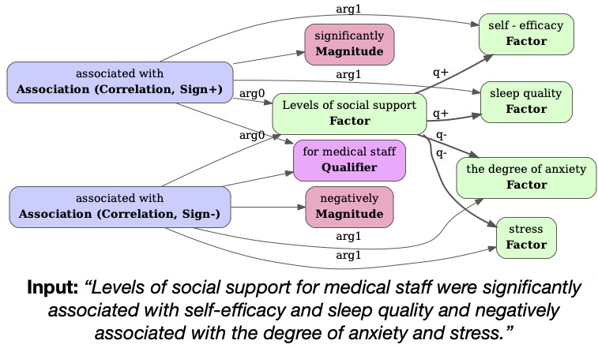

# SciClaim Dataset

This dataset is part of the paper, *[Extracting Fine-Grained Knowledge Graphs of Scientific Claims: Dataset and Transformer-Based Results](https://arxiv.org/abs/2109.10453)*, accepted for publication at EMNLP 2021.

Our dataset annotates knowledge graphs on unstructured text of scientific claims from 3 text sources: [CORD-19](CORD-19), [PubMed](PubMed), and Social and Behavioral Science ([SBS](SBS)). The annotated data are formated as json files in each of these directories organized by train, validation, and test splits as well as positive and intentional negative claims. The [types.json](types.json) file provides label type definions. Additional details are elaborated in the [paper](https://arxiv.org/abs/2109.10453).

## What are SciClaim Knowledge Graphs?
Below is an example of a SciClaim knowledge graph of the input unstructured scientific claim text. It uses entities (nodes), relations (edges), and attributes (parentheticals) to connect an independent variable via *arg0* to distinct correlations with dependent variables via *arg1*.

## Abstract

Recent transformer-based approaches demonstrate promising results on relational scientific information extraction. Existing datasets focus on high-level description of how research is carried out. Instead we focus on the subtleties of how experimental associations are presented by building SciClaim, a dataset of scientific claims drawn from Social and Behavior Science (SBS), PubMed, and CORD-19 papers. Our novel graph annotation schema incorporates not only coarse-grained entity spans as nodes and relations as edges between them, but also fine-grained attributes that modify entities and their relations, for a total of 12,738 labels in the corpus. By including more label types and more than twice the label density of previous datasets, SciClaim captures causal, comparative, predictive, statistical, and proportional associations over experimental variables along with their qualifications, subtypes, and evidence. We extend work in transformer-based joint entity and relation extraction to effectively infer our schema, showing the promise of fine-grained knowledge graphs in scientific claims and beyond.
